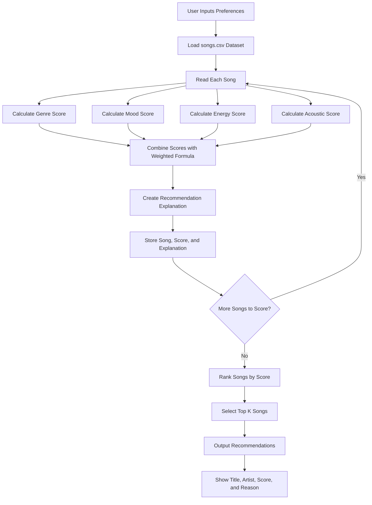
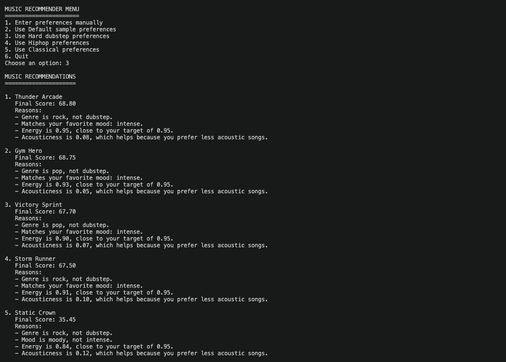

# 🎵 Music Recommender Simulation

## Project Summary

In this project you will build and explain a small music recommender system.

Your goal is to:

- Represent songs and a user "taste profile" as data
- Design a scoring rule that turns that data into recommendations
- Evaluate what your system gets right and wrong
- Reflect on how this mirrors real world AI recommenders

For each song:
Check whether the song’s genre matches the user’s favorite genre.
Check whether the song’s mood matches the user’s favorite mood.
Measure how close the song’s energy is to the user’s target energy.
Score acousticness based on whether the user likes acoustic music.
Combine the scores using weighted math.
Sort songs from highest score to lowest score.
Recommend the top k songs.

---

## How The System Works

Explain your design in plain language.

Some prompts to answer:

- What features does each `Song` use in your system
  - For example: genre, mood, energy, tempo
- What information does your `UserProfile` store
- How does your `Recommender` compute a score for each song
- How do you choose which songs to recommend

You can include a simple diagram or bullet list if helpful.



---

## Getting Started

### Setup

1. Create a virtual environment (optional but recommended):

   ```bash
   python -m venv .venv
   source .venv/bin/activate      # Mac or Linux
   .venv\Scripts\activate         # Windows

2. Install dependencies

```bash
pip install -r requirements.txt
```

3. Run the app:

```bash
python -m src.main
```

### Running Tests

Run the starter tests with:

```bash
pytest
```

You can add more tests in `tests/test_recommender.py`.

---

## Sample Recommendation Output

Paste a sample of your recommender's output here as a text block so a reader can see what it produces:

```
MUSIC RECOMMENDATIONS
=====================

1. Metro Bloom
   Final Score: 97.35
   Reasons:
   - Matches your favorite genre: pop.
   - Matches your favorite mood: happy.
   - Energy is 0.81, close to your target of 0.80.
   - Acousticness is 0.16, which helps because you prefer less acoustic songs.

2. Sunrise City
   Final Score: 96.80
   Reasons:
   - Matches your favorite genre: pop.
   - Matches your favorite mood: happy.
   - Energy is 0.82, close to your target of 0.80.
   - Acousticness is 0.18, which helps because you prefer less acoustic songs.

3. Afterglow Avenue
   Final Score: 66.50
   Reasons:
   - Genre is synthwave, not pop.
   - Matches your favorite mood: happy.
   - Energy is 0.78, close to your target of 0.80.
   - Acousticness is 0.20, which helps because you prefer less acoustic songs.

4. Victory Sprint
   Final Score: 66.45
   Reasons:
   - Matches your favorite genre: pop.
   - Mood is intense, not happy.
   - Energy is 0.90, close to your target of 0.80.
   - Acousticness is 0.07, which helps because you prefer less acoustic songs.

5. Gym Hero
   Final Score: 66.00
   Reasons:
   - Matches your favorite genre: pop.
   - Mood is intense, not happy.
   - Energy is 0.93, close to your target of 0.80.
   - Acousticness is 0.05, which helps because you prefer less acoustic songs.
```

**Screenshot or video** *(optional)*:



---

## Experiments You Tried

Use this section to document the experiments you ran. For example:

- What happened when you changed the weight on genre from 2.0 to 0.5
  When the weight on genre was changed from 0.30 to 0.5.. The performance for majority of the songs stayed consistent

- How did your system behave for different types of users
  When songs didnt match a genre, the mood, energy, and acoustic score carried the model. For example when I used dubstep, rock and pop songs were recommended, which is not a bad prediction. 

---

## Limitations and Risks

Summarize some limitations of your recommender.

One limitation is that the system uses an exact match rule for genre. A song either matches the user's favorite genre or it does not. This means related genres can be unfairly excluded or scored too low.

For example, if the user chooses pop, the system gives full genre credit to pop songs but gives no genre credit to related genres like indie pop or synthwave. Even though those songs may sound similar or match the user's taste, the algorithm treats them as completely different.

This can create a filter bubble because the recommender may keep favoring the exact same genre instead of exploring nearby styles. A better version could give partial credit to related genres, such as pop, indie pop, synthwave, and electronic.

---

## Reflection

Read and complete `model_card.md`:

[**Model Card**](model_card.md)


recommenders use different features to determine predictions from data. Different features contain a set of weights that influcence the recommendation. There is usually more than one algorithm used, common methods include collaborative filtering and context based filtering. 

One limitation is that the system uses an exact match rule for genre. A song either matches the user's favorite genre or it does not. This means related genres can be unfairly excluded or scored too low.

For example, if the user chooses pop, the system gives full genre credit to pop songs but gives no genre credit to related genres like indie pop or synthwave. Even though those songs may sound similar or match the user's taste, the algorithm treats them as completely different.

This can create a filter bubble because the recommender may keep favoring the exact same genre instead of exploring nearby styles. A better version could give partial credit to related genres, such as pop, indie pop, synthwave, and electronic.

If I wanted to expand on this project, I would try implementing a machine learning model. Starting with a neural network, but even less advanced ml models such as k-means clustering would work.